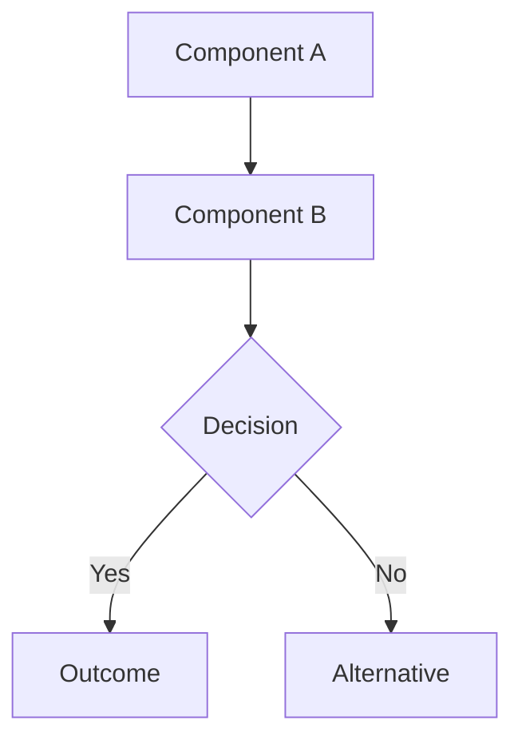

# Swictation Architecture Documentation

This directory contains comprehensive architecture documentation for the Swictation project, with a focus on system design, technical decisions, and component interactions.

---

## 📁 Directory Structure

```
architecture/
├── README.md                                    ← You are here
│
├── Cross-Platform Architecture (NEW - 2025-11-28)
│   ├── ARCHITECTURE_SUMMARY.md                 ← Executive summary
│   ├── cross-platform-abstraction-design.md    ← Complete design
│   ├── path-abstraction-implementation.md      ← Ready-to-code implementation
│   └── ARCHITECTURE_DIAGRAM.md                 ← Visual diagrams
│
├── Socket Architecture (Existing)
│   ├── SOCKET_ARCHITECTURE_SUMMARY.md          ← Quick reference
│   └── tauri-socket-architecture-analysis.md   ← Detailed analysis
│
├── adr/                                        ← Architecture Decision Records
│   ├── ADR-001-*.md                           (Future ADRs)
│   ├── ADR-002-*.md                           (Future ADRs)
│   └── ADR-003-remove-legacy-socket-implementation.md
│
└── diagrams/
    └── tauri-socket-flow.md                   ← Visual diagrams (Mermaid)
```

---

## 🚀 Quick Start

### NEW: Cross-Platform Architecture (Linux/macOS/Windows Support)

**I want to implement cross-platform support:**
**Start Here:** [`ARCHITECTURE_SUMMARY.md`](./ARCHITECTURE_SUMMARY.md) 📋
- Executive summary
- Component status matrix
- Implementation roadmap
- Quick reference guide

**I need the complete design:**
**Read:** [`cross-platform-abstraction-design.md`](./cross-platform-abstraction-design.md) 📐
- All five abstraction modules
- API specifications
- Testing strategy
- 8-week implementation plan

**I'm ready to code:**
**Code:** [`path-abstraction-implementation.md`](./path-abstraction-implementation.md) 💻
- Complete `swictation-paths` crate
- Production-ready Rust code
- Platform-specific modules (Linux, macOS, Windows)
- Migration guide

**I want visual architecture diagrams:**
**View:** [`ARCHITECTURE_DIAGRAM.md`](./ARCHITECTURE_DIAGRAM.md) 📊
- System architecture
- Data flow diagrams
- Module dependencies
- Platform-specific flows

---

### Socket Architecture (Existing)

**I want to understand the socket architecture:**
**Read:** [`SOCKET_ARCHITECTURE_SUMMARY.md`](./SOCKET_ARCHITECTURE_SUMMARY.md)
- Executive summary with quick answers
- Architecture diagrams
- Recommendations

**I need detailed technical analysis:**
**Read:** [`tauri-socket-architecture-analysis.md`](./tauri-socket-architecture-analysis.md)
- Code walkthrough
- Bug analysis
- API surface review
- Design intent

**I want to see visual diagrams:**
**Read:** [`diagrams/tauri-socket-flow.md`](./diagrams/tauri-socket-flow.md)
- Component diagrams
- Sequence diagrams
- Data flow diagrams
- State machines

**I need to understand architectural decisions:**
**Read:** [`adr/ADR-003-remove-legacy-socket-implementation.md`](./adr/ADR-003-remove-legacy-socket-implementation.md)
- Formal decision record
- Options analysis
- Implementation plan
- Risk assessment

---

## 📚 Document Types

### Architecture Decision Records (ADRs)

ADRs document significant architectural decisions with context, rationale, and consequences.

**Format:**
```markdown
# ADR-XXX: Title

**Status:** Proposed | Accepted | Deprecated | Superseded
**Date:** YYYY-MM-DD
**Deciders:** Role or Team

## Context and Problem Statement
## Decision Drivers
## Considered Options
## Decision Outcome
## Consequences
```

**Current ADRs:**
- [ADR-003: Remove Legacy Socket Implementation](./adr/ADR-003-remove-legacy-socket-implementation.md)

### Technical Analysis Documents

Deep-dive analyses of specific components or systems.

**Current Analyses:**
- [Tauri Socket Architecture Analysis](./tauri-socket-architecture-analysis.md)

### Diagrams

Visual representations using Mermaid syntax for:
- Component diagrams
- Sequence diagrams
- Data flow diagrams
- State machines
- Class diagrams

**Current Diagrams:**
- [Tauri Socket Flow Diagrams](./diagrams/tauri-socket-flow.md)

---

## 🏗️ System Overview

### High-Level Architecture

```
┌─────────────────────────────────────────────────────────┐
│                    Swictation System                    │
├─────────────────────────────────────────────────────────┤
│                                                         │
│  ┌───────────────┐              ┌──────────────┐      │
│  │   Daemon      │◄────IPC─────►│  Tauri UI    │      │
│  │   Process     │              │   Process    │      │
│  │               │              │              │      │
│  │ • Hotkey      │              │ • React UI   │      │
│  │ • Transcribe  │              │ • Metrics    │      │
│  │ • Database    │              │ • Tray Menu  │      │
│  └───────┬───────┘              └──────┬───────┘      │
│          │                             │              │
│          └─────────────┬───────────────┘              │
│                        │                              │
│              ┌─────────▼──────────┐                   │
│              │  Unix Sockets      │                   │
│              │  (XDG Runtime Dir) │                   │
│              └────────────────────┘                   │
│                                                         │
└─────────────────────────────────────────────────────────┘
```

### Key Components

1. **Daemon Process** (`rust-crates/swictation-daemon/`)
   - Global hotkey listener
   - Audio capture and transcription
   - SQLite database management
   - Metrics broadcasting
   - IPC command server

2. **Tauri UI Process** (`tauri-ui/`)
   - React frontend for metrics visualization
   - System tray integration
   - Database query interface
   - Real-time event consumption

3. **Unix Sockets** (Communication Layer)
   - `swictation.sock` - IPC commands (toggle recording)
   - `swictation_metrics.sock` - Metrics broadcast (events)

---

## 🎯 Architectural Principles

### 1. Separation of Concerns
- **Daemon:** Core transcription logic, system integration
- **UI:** Visualization, user interaction
- **Sockets:** Inter-process communication boundary

### 2. Event-Driven Architecture
- Frontend consumes Tauri events (not direct API calls)
- Daemon broadcasts state changes to all listeners
- Loose coupling between processes

### 3. Security-First Design
- Socket permissions: 0600 (owner-only access)
- XDG-compliant paths (no world-writable `/tmp`)
- Process isolation with IPC boundary

### 4. Platform Portability
- XDG Runtime Dir on Linux (best practice)
- Application Support on macOS (platform standard)
- Fallback to `~/.local/share` when needed

### 5. Type Safety
- Strongly-typed event enums (`MetricsEvent`)
- Serde serialization for IPC protocol
- Compile-time validation over runtime checks

---

## 🔍 Key Architectural Decisions

### Socket Communication Design

**Decision:** Dual-socket architecture with separation of concerns

**Rationale:**
- **Command socket (`swictation.sock`):** Request/response for control
- **Metrics socket (`swictation_metrics.sock`):** One-way broadcast for data

**Benefits:**
- ✅ Clear separation of read/write operations
- ✅ Multiple clients can read metrics simultaneously
- ✅ CLI tools can send commands without UI
- ✅ Prevents command/data protocol conflicts

**See:** [ADR-003](./adr/ADR-003-remove-legacy-socket-implementation.md)

### Event-Based Frontend Communication

**Decision:** Use Tauri events instead of direct Rust function calls

**Rationale:**
- Frontend should be reactive, not imperative
- Events decouple UI from backend implementation
- Supports multiple listeners (future extensibility)

**Implementation:**
```rust
// Backend emits events
app_handle.emit("transcription", event)?;

// Frontend listens to events
listen('transcription', (event) => {
    updateState(event.payload);
});
```

### Async Runtime with Tokio

**Decision:** Use Tokio async runtime for all I/O operations

**Rationale:**
- Modern Rust async/await patterns
- Non-blocking socket operations
- Integration with Tauri's async runtime

**Migration:** Replaced legacy sync `std::os::unix::net::UnixStream` with `tokio::net::UnixStream`

---

## 📊 Component Interactions

### Transcription Flow

```
User speaks
    ↓
Daemon captures audio
    ↓
Whisper model transcribes
    ↓
Database stores result
    ↓
MetricsBroadcaster emits event
    ↓
Unix socket (swictation_metrics.sock)
    ↓
MetricsSocket receives event
    ↓
Tauri AppHandle emits frontend event
    ↓
React component updates UI
```

### Toggle Recording Flow

```
User clicks tray menu
    ↓
Tray icon handler emits internal event
    ↓
send_toggle_command() connects to IPC socket
    ↓
Writes JSON: {"action":"toggle"}
    ↓
IPC Server receives command
    ↓
Daemon.toggle() changes state
    ↓
State change broadcasts to metrics socket
    ↓
Frontend receives state update event
```

---

## 🧪 Testing Architecture

### Unit Tests
- Socket path validation
- Event deserialization
- Command parsing

### Integration Tests
- Socket communication (daemon ↔ UI)
- Event flow (emit → receive)
- State synchronization

### Manual Testing
```bash
# Test IPC socket directly
echo '{"action":"toggle"}' | nc -U $XDG_RUNTIME_DIR/swictation.sock

# Monitor metrics socket
nc -U $XDG_RUNTIME_DIR/swictation_metrics.sock

# Check socket permissions
ls -la $XDG_RUNTIME_DIR/swictation*.sock
```

---

## 🛠️ Development Guidelines

### Adding New Architecture Documentation

1. **Create document in appropriate directory:**
   - Analysis → `architecture/`
   - Decision → `architecture/adr/`
   - Diagrams → `architecture/diagrams/`

2. **Use standard templates:**
   - ADR: Follow ADR-003 format
   - Analysis: Include problem statement, current state, recommendations
   - Diagrams: Use Mermaid syntax for portability

3. **Update this README:**
   - Add to "Current ADRs" or "Current Analyses"
   - Update quick start guide if needed

### Diagram Guidelines

**Use Mermaid for all diagrams:**


**Benefits:**
- Version control friendly (text-based)
- Renders in GitHub, GitLab, VS Code
- Easy to update

**Diagram Types:**
- `graph` - Flowcharts and data flow
- `sequenceDiagram` - Interaction sequences
- `stateDiagram` - State machines
- `classDiagram` - Class relationships

---

## 📖 Further Reading

### Project Documentation
- [`/docs/README.md`](../README.md) - Main documentation index
- [`/rust-crates/swictation-daemon/README.md`](../../rust-crates/swictation-daemon/README.md) - Daemon implementation
- [`/tauri-ui/README.md`](../../tauri-ui/README.md) - UI implementation

### External References
- [ADR Template](https://github.com/joelparkerhenderson/architecture-decision-record)
- [C4 Model](https://c4model.com/) - System architecture diagrams
- [Tokio Async Runtime](https://tokio.rs/)
- [Tauri Framework](https://tauri.app/)
- [XDG Base Directory Specification](https://specifications.freedesktop.org/basedir-spec/basedir-spec-latest.html)

---

## 🤝 Contributing

When making significant architectural changes:

1. **Document the decision:**
   - Create an ADR in `adr/`
   - Number sequentially (ADR-004, ADR-005, etc.)
   - Follow the ADR template

2. **Create diagrams:**
   - Add visual representations in `diagrams/`
   - Use Mermaid syntax
   - Include multiple views (component, sequence, state)

3. **Update this README:**
   - Link to new documents
   - Update quick start guide
   - Keep document index current

4. **Review process:**
   - ADRs should be reviewed by technical lead
   - Mark status as "Proposed" initially
   - Update to "Accepted" after approval

---

## 📞 Questions?

For architecture-related questions:

1. **Check existing documentation:**
   - Search this directory for relevant topics
   - Review ADRs for historical context

2. **Examine implementation:**
   - Code is documented with inline comments
   - Tests demonstrate usage patterns

3. **Open discussion:**
   - Create GitHub issue with "architecture" label
   - Reference relevant ADRs in discussion

---

## 🗺️ Roadmap

### Planned Documentation

- [ ] ADR-004: Database schema evolution strategy
- [ ] ADR-005: Platform-specific hotkey handling
- [ ] ADR-006: Error handling and recovery patterns
- [ ] Component diagram: Full system architecture
- [ ] Deployment diagram: Production environment

### Future Analyses

- [ ] Performance characteristics of socket communication
- [ ] Security audit of IPC protocol
- [ ] Database query optimization patterns
- [ ] Frontend state management architecture

---

**Last Updated:** 2025-11-26
**Maintainer:** System Architecture Designer
