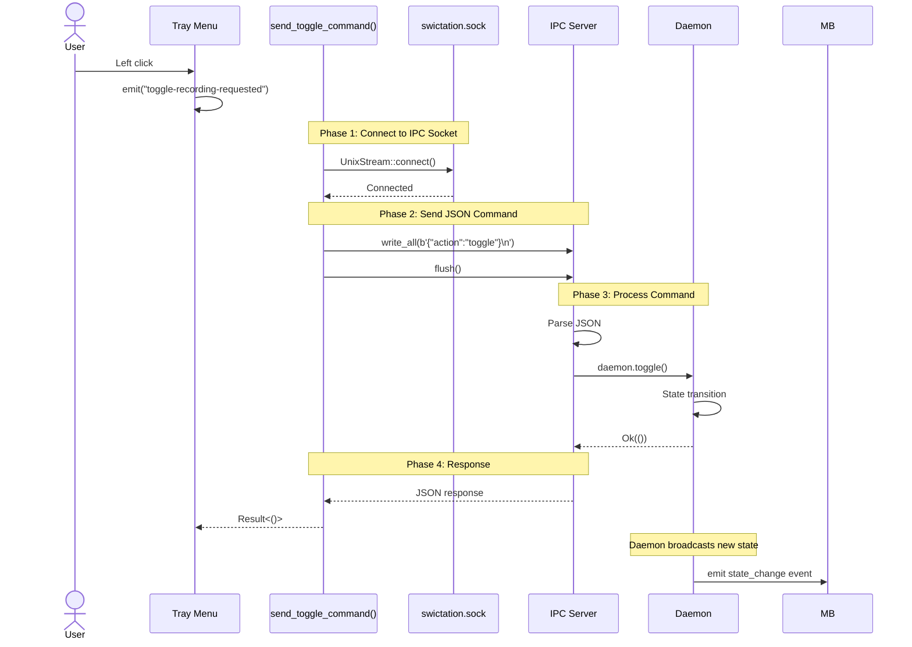
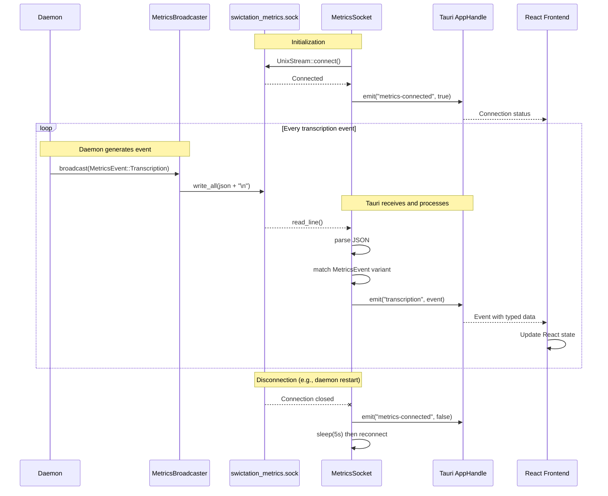
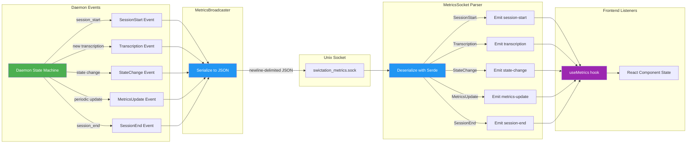
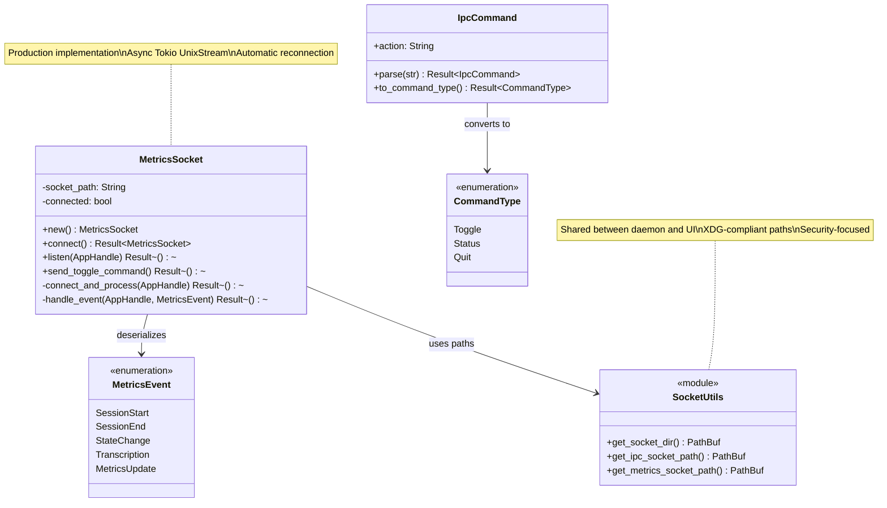
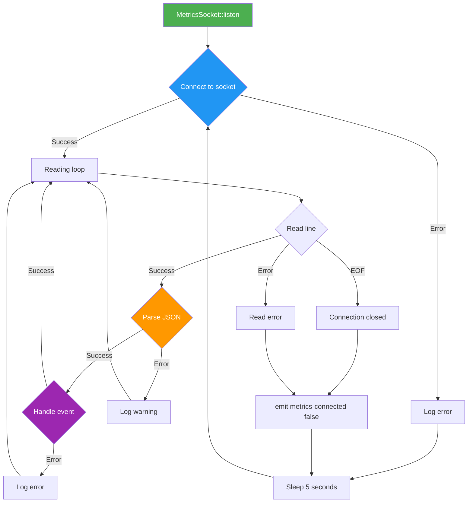
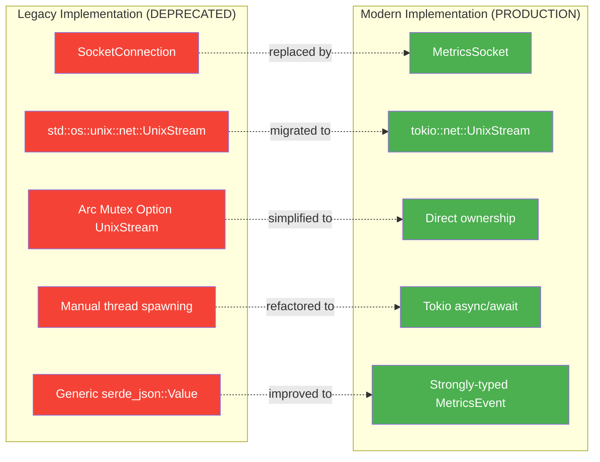

# Tauri Socket Architecture - Visual Diagrams

## Component Diagram: Dual-Socket Architecture

```mermaid
graph TB
    subgraph "Daemon Process"
        D[Daemon State Machine]
        IPC[IPC Server<br/>swictation.sock]
        MB[Metrics Broadcaster<br/>swictation_metrics.sock]

        D -->|broadcast events| MB
        IPC -->|toggle commands| D
    end

    subgraph "Tauri UI Process"
        TM[Tray Menu]
        MS[MetricsSocket]
        FE[React Frontend]

        TM -->|click| SC[send_toggle_command]
        SC -->|{"action":"toggle"}| IPC
        MS -->|listen loop| MB
        MS -->|emit events| FE
    end

    subgraph "Socket Layer"
        S1["/run/user/1000/<br/>swictation.sock"]
        S2["/run/user/1000/<br/>swictation_metrics.sock"]

        IPC -.->|bind| S1
        MB -.->|bind| S2
        SC -.->|connect| S1
        MS -.->|connect| S2
    end

    style D fill:#4CAF50,color:#fff
    style MB fill:#2196F3,color:#fff
    style IPC fill:#FF9800,color:#fff
    style MS fill:#2196F3,color:#fff
    style SC fill:#FF9800,color:#fff
    style FE fill:#9C27B0,color:#fff
```

---

## Sequence Diagram: Toggle Recording Flow



---

## Sequence Diagram: Metrics Streaming Flow



---

## Data Flow Diagram: Event Types



---

## Class Diagram: Socket Module Structure



---

## State Machine Diagram: MetricsSocket Lifecycle

```mermaid
stateDiagram-v2
    [*] --> Disconnected: new()

    Disconnected --> Connecting: listen() called
    Connecting --> Connected: UnixStream::connect() succeeds
    Connecting --> Disconnected: Connection failed (retry after 5s)

    Connected --> Reading: emit("metrics-connected", true)
    Reading --> Parsing: read_line() returns data
    Parsing --> Emitting: serde_json::from_str() succeeds
    Emitting --> Reading: emit event to frontend

    Reading --> Disconnected: Connection closed or error
    Parsing --> Reading: Parse error (log warning)

    Disconnected --> [*]: Process exit

    note right of Connected
        Socket connection established
        Buffered reader created
        Frontend notified
    end note

    note right of Parsing
        Deserialize with custom deserializers:
        - flexible_number (f64/u64)
        - flexible_timestamp (u64/f64/string)
    end note
```

---

## Deployment Diagram: Socket Filesystem Layout

```
Linux (XDG_RUNTIME_DIR):
/run/user/1000/
├── swictation.sock           ← IPC commands (permissions: 0600)
└── swictation_metrics.sock   ← Metrics broadcast (permissions: 0600)

Linux (fallback):
~/.local/share/swictation/
├── swictation.sock           ← IPC commands (permissions: 0600)
└── swictation_metrics.sock   ← Metrics broadcast (permissions: 0600)

macOS:
~/Library/Application Support/swictation/
├── swictation.sock           ← IPC commands (permissions: 0600)
└── swictation_metrics.sock   ← Metrics broadcast (permissions: 0600)
```

### Security Model

```mermaid
graph TB
    subgraph "Process Isolation"
        D[Daemon<br/>UID 1000]
        U[Tauri UI<br/>UID 1000]
        C[CLI Tool<br/>UID 1000]
    end

    subgraph "Socket Permissions (0600)"
        S1[swictation.sock<br/>owner: UID 1000<br/>rw-------]
        S2[swictation_metrics.sock<br/>owner: UID 1000<br/>rw-------]
    end

    D -->|bind/listen| S1
    D -->|bind/broadcast| S2
    U -->|connect/write| S1
    U -->|connect/read| S2
    C -->|connect/write| S1

    X[Other Users<br/>UID ≠ 1000] -.x|permission denied| S1
    X -.x|permission denied| S2

    style D fill:#4CAF50,color:#fff
    style U fill:#2196F3,color:#fff
    style C fill:#FF9800,color:#fff
    style S1 fill:#F44336,color:#fff
    style S2 fill:#F44336,color:#fff
    style X fill:#9E9E9E,color:#fff
```

---

## Component Interaction: Full System Flow

```mermaid
graph TB
    subgraph "User Interactions"
        U1[Hotkey: Ctrl+Shift+D]
        U2[Tray Menu: Toggle Recording]
        U3[CLI: echo '{\"action\":\"toggle\"}' | nc]
    end

    subgraph "Daemon Process"
        HS[Hotkey Service]
        IPC[IPC Server]
        D[Daemon Core]
        T[Transcription Engine]
        MB[Metrics Broadcaster]
    end

    subgraph "Sockets"
        S1[swictation.sock]
        S2[swictation_metrics.sock]
    end

    subgraph "Tauri UI"
        TM[Tray Menu Handler]
        SC[send_toggle_command]
        MS[MetricsSocket]
        APP[AppHandle]
        FE[React Components]
    end

    U1 -->|keyboard event| HS
    U2 -->|click| TM
    U3 -->|JSON command| S1

    HS -->|toggle()| D
    TM -->|invoke| SC
    SC -->|write JSON| S1
    S1 -->|read| IPC
    IPC -->|toggle()| D

    D -->|state change| T
    T -->|transcription| D
    D -->|events| MB
    MB -->|broadcast| S2

    S2 -->|read lines| MS
    MS -->|emit events| APP
    APP -->|props| FE

    style D fill:#4CAF50,color:#fff
    style MB fill:#2196F3,color:#fff
    style MS fill:#2196F3,color:#fff
    style FE fill:#9C27B0,color:#fff
```

---

## Performance Characteristics

### Metrics Socket Performance

```
Throughput:
- Event rate: ~1-10 events/second (during active transcription)
- Latency: <5ms from daemon broadcast to frontend receive
- Bandwidth: ~100-500 bytes/event (JSON serialized)

Reconnection Strategy:
- Automatic retry every 5 seconds on disconnect
- No event loss (daemon buffers recent events)
- Frontend displays connection status in real-time

Concurrency:
- Single async task per socket connection
- Non-blocking reads with Tokio BufReader
- Events emitted via Tauri's thread-safe AppHandle
```

### IPC Socket Performance

```
Request/Response Pattern:
- Synchronous write + flush
- No response reading (fire-and-forget for toggle)
- Latency: <10ms for round-trip

Security:
- Owner-only permissions (0600)
- JSON-only protocol (no binary exploits)
- Input validation in daemon IPC handler

Scalability:
- Single connection per toggle request
- Connection pooling not needed (infrequent use)
- CLI tools can send commands concurrently
```

---

## Error Handling Flow



---

## Migration Path: Legacy to Modern



---

## References

- Architecture Analysis: `tauri-socket-architecture-analysis.md`
- ADR: `adr/ADR-003-remove-legacy-socket-implementation.md`
- Implementation: `tauri-ui/src-tauri/src/socket/metrics.rs`
- Daemon IPC: `rust-crates/swictation-daemon/src/ipc.rs`
