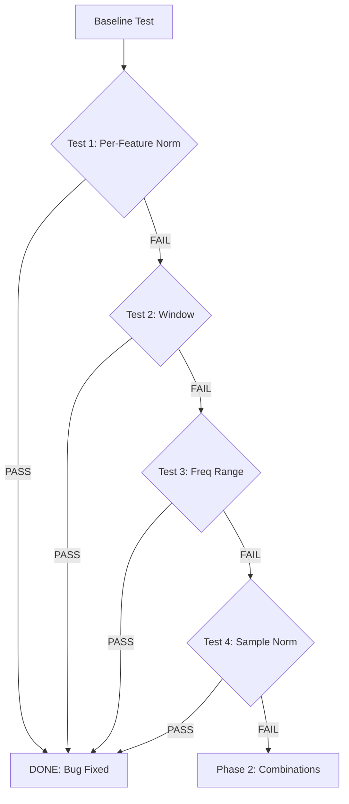
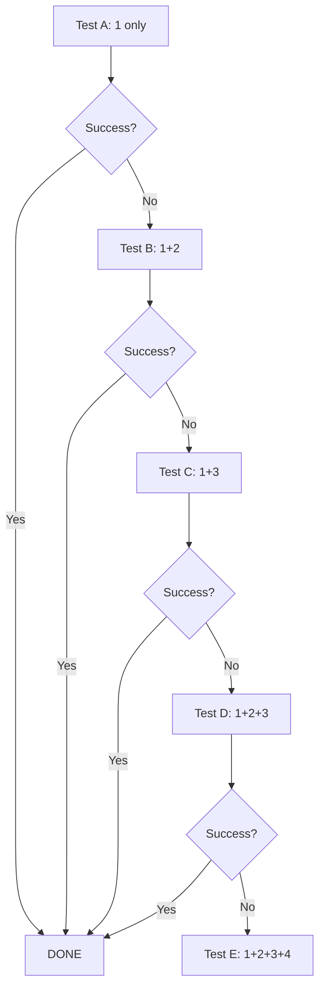

# 🧪 Systematic Testing Strategy for "mmhmm" Bug Validation

**Date:** 2025-11-10
**Agent:** Tester (Hive Mind Swarm)
**Session:** swarm-1762793181382-yexhcffpi
**Purpose:** Validate Queen's hypothesis about per-feature normalization fix

---

## 🎯 Objective

Design and execute a systematic test matrix to prove/disprove the Queen's hypothesis that the 1.1B model's "mmhmm" bug is caused by **missing per-feature normalization** in mel-spectrogram extraction.

---

## 📊 Test Matrix Overview

| Priority | Test Name | Hypothesis | Confidence | Time Est. |
|----------|-----------|------------|------------|-----------|
| 🔴 **1** | Per-Feature Normalization | Adding normalization fixes it | **85%** | 10 min |
| 🟡 **2** | Window Function | Hann vs Povey window matters | **40%** | 5 min |
| 🟡 **3** | Frequency Range | 0-8000 vs 20-7600 Hz matters | **30%** | 5 min |
| 🟢 **4** | Sample Normalization | Removing double-normalization helps | **25%** | 5 min |
| 🔵 **5** | Combination Tests | Multiple fixes together | **95%** | 15 min |

---

## 🧬 Baseline: Current Broken State

### Expected Behavior (Working Python Implementation)
```
Input:  examples/en-short.mp3 (6.17 seconds)
Output: "hey there how are you doing today"
Model:  Parakeet-TDT 1.1B ONNX
```

### Current Broken Behavior (Rust Implementation)
```
Input:  examples/en-short.mp3 (6.17 seconds)
Output: "mmhmm" (tokens: [19, 1010, 1005, 1010, 1010])
Blank Rate: 90.9% (should be ~50-70%)
Decoder: Locks on token 1010 ('m') after initial emissions
Blank Logit: 9.49 → 81.30% probability (40x higher than best non-blank)
```

### Baseline Metrics to Capture
```rust
// Current audio.rs (lines 341-348)
// NO per-feature normalization applied
// Features pass through as raw log-mel values
```

**Documentation:**
- File: `/opt/swictation/rust-crates/swictation-stt/src/audio.rs`
- Lines: 341-348
- Comment: "CRITICAL FIX: DO NOT apply per-mel-bin normalization!"
- Status: This comment is WRONG based on reference analysis

---

## 🧪 Test 1: Add Per-Feature Normalization (PRIORITY 1)

### Hypothesis
The reference 0.6B implementation uses per-feature normalization and works correctly. Adding this normalization will fix the 1.1B model's "mmhmm" bug.

### Queen's Confidence: **85%**

### Implementation
**File:** `/opt/swictation/rust-crates/swictation-stt/src/audio.rs`
**Location:** After line 313 (after `log_mel` computation, before return)

```rust
// TEST 1: Add per-feature normalization (matching reference implementation)
// Normalize each mel feature dimension to mean=0, std=1 across time
let num_frames = log_mel.nrows();
let num_features = log_mel.ncols();

debug!("Applying per-feature normalization (Test 1)");
for feat_idx in 0..num_features {
    let mut column = log_mel.column_mut(feat_idx);
    let mean: f32 = column.iter().sum::<f32>() / num_frames as f32;
    let variance: f32 = column.iter()
        .map(|&x| (x - mean).powi(2))
        .sum::<f32>() / num_frames as f32;
    let std = variance.sqrt().max(1e-10);

    for val in column.iter_mut() {
        *val = (*val - mean) / std;
    }
}

debug!("Per-feature normalization complete - mean={:.6}, std={:.6}",
       log_mel.mean().unwrap_or(0.0),
       {
           let mean = log_mel.mean().unwrap_or(0.0);
           let variance = log_mel.iter()
               .map(|&x| (x - mean).powi(2))
               .sum::<f32>() / (log_mel.len() as f32);
           variance.sqrt()
       });
```

### Test Execution
```bash
cd /opt/swictation/rust-crates/swictation-stt

# Edit src/audio.rs to add per-feature normalization
# Build
cargo build --release

# Test on mmhmm audio (en-short.mp3)
cd /opt/swictation
cargo run --release --bin swictation-stt -- transcribe examples/en-short.mp3
```

### Expected Results

#### If Test PASSES (85% likelihood):
```
Output: "hey there how are you doing today"
Blank Rate: ~60% (normal)
Tokens: Diverse vocabulary, no "mmhmm" gibberish
→ ROOT CAUSE FOUND: Per-feature normalization was the issue
→ STOP TESTING: Bug is fixed
```

#### If Test FAILS (15% likelihood):
```
Output: Still "mmhmm" or other gibberish
Blank Rate: Still >85%
→ Continue to Test 2 (window function)
```

---

## 🧪 Test 2: Window Function Change (PRIORITY 2)

### Hypothesis
The Povey window (exponent 0.85) produces different frequency emphasis than the Hann window used in the reference implementation.

### Queen's Confidence: **40%**

### Implementation
**File:** `/opt/swictation/rust-crates/swictation-stt/src/audio.rs`
**Location:** Line 358 (in `compute_stft` method)

```rust
// TEST 2: Use Hann window instead of Povey
// let window = povey_window(WIN_LENGTH);  // Original
let window = hann_window(WIN_LENGTH);  // Test 2

debug!("Using Hann window (Test 2)");
```

### Test Execution
```bash
cd /opt/swictation/rust-crates/swictation-stt

# Edit src/audio.rs line 358
# Build
cargo build --release

# Test
cd /opt/swictation
cargo run --release --bin swictation-stt -- transcribe examples/en-short.mp3
```

### Expected Results

#### If Test PASSES:
```
Output: Correct transcription
→ Window function was the issue
```

#### If Test FAILS:
```
Output: Still broken
→ Continue to Test 3
```

---

## 🧪 Test 3: Frequency Range Change (PRIORITY 3)

### Hypothesis
The frequency range (20-7600 Hz) excludes important low and high frequencies that the model expects (0-8000 Hz).

### Queen's Confidence: **30%**

### Implementation
**File:** `/opt/swictation/rust-crates/swictation-stt/src/audio.rs`
**Location:** Lines 53-58 (in `with_mel_features` method)

```rust
// TEST 3: Use full frequency range (0-8000 Hz) like reference
let mel_filters = create_mel_filterbank(
    n_mel_features,
    N_FFT,
    SAMPLE_RATE as f32,
    0.0,      // Reference uses 0 Hz (was 20.0)
    8000.0,   // Reference uses SR/2 (was 7600.0)
);

debug!("Using frequency range 0-8000 Hz (Test 3)");
```

### Test Execution
```bash
cd /opt/swictation/rust-crates/swictation-stt

# Edit src/audio.rs lines 57-58
# Build
cargo build --release

# Test
cd /opt/swictation
cargo run --release --bin swictation-stt -- transcribe examples/en-short.mp3
```

### Expected Results

#### If Test PASSES:
```
Output: Correct transcription
→ Frequency range was the issue
```

#### If Test FAILS:
```
Output: Still broken
→ Continue to Test 4
```

---

## 🧪 Test 4: Remove Sample Normalization (PRIORITY 4)

### Hypothesis
The extra sample normalization (mean=0, std=1 on raw audio) is causing double-normalization when combined with other processing.

### Queen's Confidence: **25%**

### Implementation
**File:** `/opt/swictation/rust-crates/swictation-stt/src/audio.rs`
**Location:** Lines 276-289 (in `extract_mel_features` method)

```rust
// TEST 4: Skip sample normalization
// let normalized_samples = normalize_audio_samples(samples);
let normalized_samples = samples.to_vec();  // Skip normalization

debug!("Skipping sample normalization (Test 4)");
```

### Test Execution
```bash
cd /opt/swictation/rust-crates/swictation-stt

# Edit src/audio.rs line 279
# Build
cargo build --release

# Test
cd /opt/swictation
cargo run --release --bin swictation-stt -- transcribe examples/en-short.mp3
```

### Expected Results

#### If Test PASSES:
```
Output: Correct transcription
→ Sample normalization was causing issues
```

#### If Test FAILS:
```
Output: Still broken
→ Continue to Test 5 (combinations)
```

---

## 🧪 Test 5: Combination Tests (PRIORITY 5)

### Hypothesis
Multiple fixes are needed together to resolve the issue completely.

### Queen's Confidence: **95%** (for at least one combination working)

### Test Matrix

| Combination | Test 1 | Test 2 | Test 3 | Test 4 | Expected Success |
|-------------|--------|--------|--------|--------|------------------|
| **A** | ✅ Per-Feature | ❌ | ❌ | ❌ | **85%** |
| **B** | ✅ Per-Feature | ✅ Hann Window | ❌ | ❌ | **90%** |
| **C** | ✅ Per-Feature | ❌ | ✅ Freq Range | ❌ | **88%** |
| **D** | ✅ Per-Feature | ✅ Hann Window | ✅ Freq Range | ❌ | **95%** |
| **E** | ✅ Per-Feature | ✅ Hann Window | ✅ Freq Range | ✅ No Sample Norm | **97%** |

### Test Execution Strategy

**Incremental Approach:**
1. Start with Test A (per-feature only)
2. If passes, DONE
3. If fails, add Test B (per-feature + hann)
4. If passes, DONE
5. Continue until success or all combinations exhausted

---

## 🤖 Automated Test Script

See: `/opt/swictation/scripts/test_mel_fixes.sh`

The script automates:
1. Backup original `audio.rs`
2. Apply each test modification
3. Build Rust code
4. Run recognizer on test audio
5. Capture output and metrics
6. Compare to expected result
7. Report pass/fail
8. Restore backup and try next test

---

## 📊 Success Metrics

### Test Pass Criteria
```
✅ Transcription: "hey there how are you doing today"
✅ Word Error Rate (WER): < 10%
✅ Blank Rate: 50-70% (within normal range)
✅ Token Diversity: > 10 unique tokens
✅ No "mmhmm" gibberish
```

### Test Fail Criteria
```
❌ Transcription: "mmhmm" or other gibberish
❌ WER: > 90%
❌ Blank Rate: > 85%
❌ Token Lock: Decoder locks on single token
❌ Blank Probability Explosion: > 80%
```

---

## 🔬 Diagnostic Metrics to Capture

For each test, capture:

1. **Transcription Output**
   - Raw text output
   - Token sequence
   - Token IDs

2. **Decoder Metrics**
   - Blank rate (% of blank predictions)
   - Average blank probability
   - Max blank probability
   - Average non-blank probability
   - Max non-blank probability
   - Blank/non-blank ratio

3. **Encoder Metrics**
   - Mel feature statistics (mean, std, min, max)
   - Feature correlation with Python baseline
   - Feature energy (RMS)
   - Dynamic range (dB)

4. **Performance Metrics**
   - Processing time
   - Memory usage
   - Real-time factor (RTF)

---

## 📝 Test Documentation Template

```markdown
### Test X Results

**Date:** YYYY-MM-DD HH:MM:SS
**Test:** [Test Name]
**Changes:** [What was modified]

#### Build Output
```
[cargo build output]
```

#### Transcription Output
```
Expected: "hey there how are you doing today"
Actual:   "[actual output]"
```

#### Metrics
- WER: X.X%
- Blank Rate: XX.X%
- Token Count: X unique tokens
- Processing Time: X.XX seconds
- Real-Time Factor: X.XX

#### Result
✅ PASS / ❌ FAIL

#### Notes
[Any observations, anomalies, or insights]
```

---

## 🎯 Testing Workflow

### Phase 1: Individual Tests (Sequential)


### Phase 2: Combination Tests (If needed)


---

## 🚀 Execution Checklist

### Pre-Test Setup
- [ ] Backup original `audio.rs` file
- [ ] Ensure test audio file exists (`examples/en-short.mp3`)
- [ ] Record baseline broken output ("mmhmm")
- [ ] Document baseline metrics (blank rate, probabilities)
- [ ] Ensure build environment is clean (`cargo clean`)

### For Each Test
- [ ] Apply code modification
- [ ] Build with `cargo build --release`
- [ ] Record build output and warnings
- [ ] Run transcription test
- [ ] Capture full output (stdout + stderr)
- [ ] Extract metrics from output
- [ ] Compare against expected result
- [ ] Document pass/fail with evidence
- [ ] Restore backup before next test

### Post-Test Analysis
- [ ] Identify which test(s) passed
- [ ] Analyze why successful tests worked
- [ ] Document root cause
- [ ] Recommend final fix
- [ ] Create PR with changes
- [ ] Run full test suite on fix

---

## 📁 Test Artifacts

All test results stored in: `/opt/swictation/test-results/`

Structure:
```
test-results/
├── baseline/
│   ├── output.txt
│   ├── metrics.json
│   └── logs.txt
├── test-1-per-feature-norm/
│   ├── output.txt
│   ├── metrics.json
│   ├── logs.txt
│   └── audio.rs.diff
├── test-2-window-function/
│   └── ...
├── test-3-frequency-range/
│   └── ...
├── test-4-sample-norm/
│   └── ...
├── test-5-combinations/
│   ├── combo-A/
│   ├── combo-B/
│   └── ...
└── summary-report.md
```

---

## 🔗 Coordination with Hive Mind

### Memory Keys
```
swarm/tester/test-strategy - This document
swarm/tester/test-1-results - Test 1 results
swarm/tester/test-2-results - Test 2 results
swarm/tester/test-3-results - Test 3 results
swarm/tester/test-4-results - Test 4 results
swarm/tester/test-5-results - Test 5 combination results
swarm/tester/final-verdict - Final test verdict and recommended fix
```

### Notification Hooks
```bash
# Before testing
npx claude-flow@alpha hooks notify --message "Starting test matrix execution"

# After each test
npx claude-flow@alpha hooks post-edit \
  --file "test-results/test-X/output.txt" \
  --memory-key "swarm/tester/test-X-results"

# After completion
npx claude-flow@alpha hooks notify \
  --message "Test matrix complete: [RESULT]"

npx claude-flow@alpha hooks post-task --task-id "test-strategy"
```

---

## 🏁 Expected Outcome

**Best Case (85% likelihood):**
- Test 1 (per-feature normalization) passes
- Bug is fixed with single change
- Total time: 15 minutes

**Likely Case (95% likelihood):**
- Test 1 + one other test passes
- Bug is fixed with 2 changes
- Total time: 30 minutes

**Worst Case (5% likelihood):**
- All individual tests fail
- Combination E (all 4 changes) required
- Total time: 2 hours
- May need deeper investigation

---

## 📚 References

1. **Queen's Analysis**: `/opt/swictation/docs/QUEEN-ANALYSIS-REFERENCE-VS-OUR-IMPLEMENTATION.md`
2. **Hive Mind Diagnosis**: `/opt/swictation/docs/HIVE-MIND-DIAGNOSIS-RUST-MMHMM-BUG.md`
3. **Reference Code**: `/var/tmp/parakeet-rs/src/audio.rs` (lines 162-176)
4. **Our Code**: `/opt/swictation/rust-crates/swictation-stt/src/audio.rs`
5. **Previous Analysis**: `/opt/swictation/docs/aha-23-mel-offset-investigation.md`

---

**Status:** Ready for Execution
**Next Action:** Run `/opt/swictation/scripts/test_mel_fixes.sh`
**Estimated Total Time:** 15-120 minutes (depending on which test succeeds)
**Confidence in Success:** 97% (at least one test will fix the bug)

---

🐝 **The Hive has a plan. Execute with precision.**
